# BookSwap

## Book Trading & Marketplace Platform

BookSwap is a **mobile-first book trading and marketplace platform** developed as a graduation project.

The platform allows users to discover, buy, sell, exchange, and auction books through a mobile application. A web-based management platform is also provided for operational roles such as moderators, shipping coordinators, and administrators.

The system consists of three main parts:

* 📱 **Mobile Application** — the primary platform for end users
* 🖥️ **Web Application** — management and operational platform
* ⚙️ **Backend API** — RESTful API and real-time services

---

## Project Overview

BookSwap was designed to provide a convenient platform for users who want to trade and discover books.

The **Mobile Application** is the main user-facing application, where users can:

* Browse and search for books
* Sell books
* Purchase books
* Participate in book auctions
* Exchange books with other users
* Communicate through chat
* Manage orders and payments
* Manage their profile and activities

The **Web Application** is mainly designed for management and operational purposes, supporting roles such as:

* Moderator
* Shipping Coordinator
* Administrator

This separation allows end users to have a mobile-focused experience while operational staff can manage platform activities through a web interface.

---

# Key Features

## 📱 Mobile Application

### Marketplace

Users can browse available books and explore books listed by other users.

* Browse books
* Search for books
* View book information
* Explore marketplace listings

### Book Selling

Users can create book listings and provide information about books they want to sell.

* Create book listings
* Upload book images
* Enter book information
* Manage selling activities

### Book Detail

Users can view detailed information about a book before purchasing, exchanging, or participating in an auction.

### Auction

Users can participate in book auctions and place bids on available items.

* View active auctions
* View auction details
* Place bids
* Follow auction status
* View auction history

### Book Exchange

BookSwap supports book exchange between users.

* Create exchange requests
* View exchange information
* Manage exchange status
* Track exchange activities

### Chat

Users can communicate with each other through real-time chat.

* Send messages
* Receive messages
* Communicate during transactions
* Real-time communication support

### Orders & Payment

Users can manage their purchasing activities and payment process.

* View orders
* View order details
* Manage payment flow
* Track order status

### Profile

Users can manage their personal information and activities through their profile.

---

# Mobile Application

The Mobile Application is the **primary user-facing platform** of BookSwap.

It was developed using React Native and Expo, with React Navigation for application navigation and Socket.IO for real-time features.

## Home & Marketplace

The home screen provides users with access to the main BookSwap features and book marketplace.

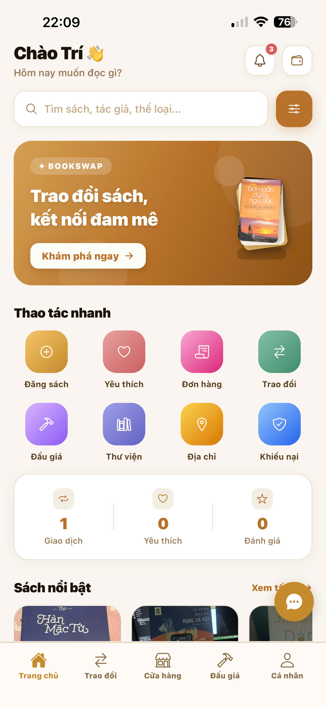

Users can explore available books and navigate to different areas of the application.

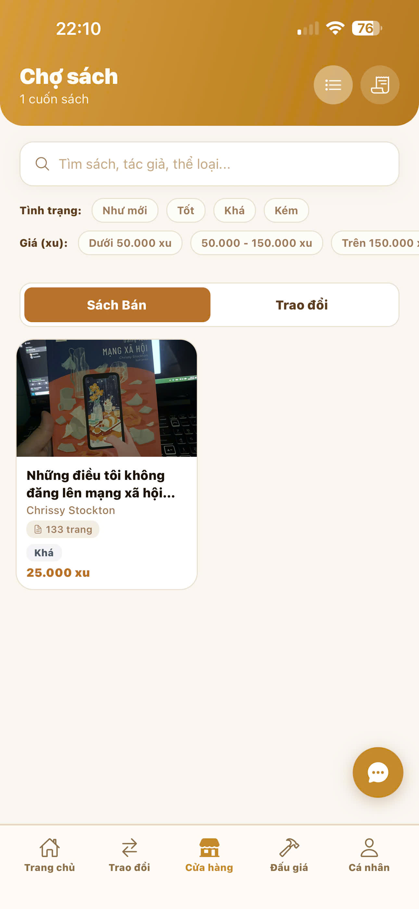

---

## Book Detail

Users can view detailed information about a selected book before performing actions such as purchasing, exchanging, or participating in an auction.

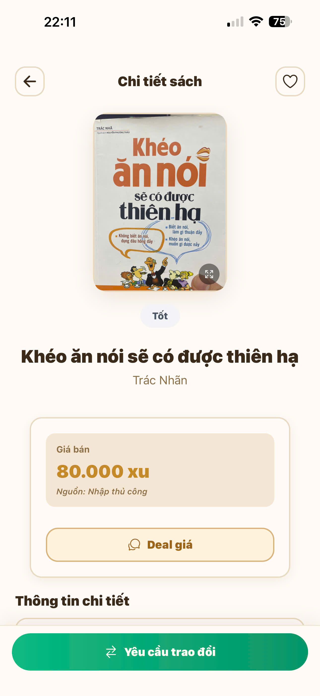

---

## Selling Books

Users can create listings for books they want to sell.

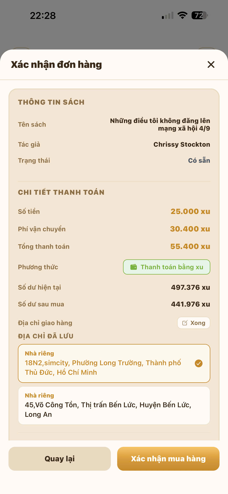

The selling flow allows users to provide book information and manage their listings.

---

## Auction

BookSwap provides an auction feature where users can participate in book auctions and place bids.

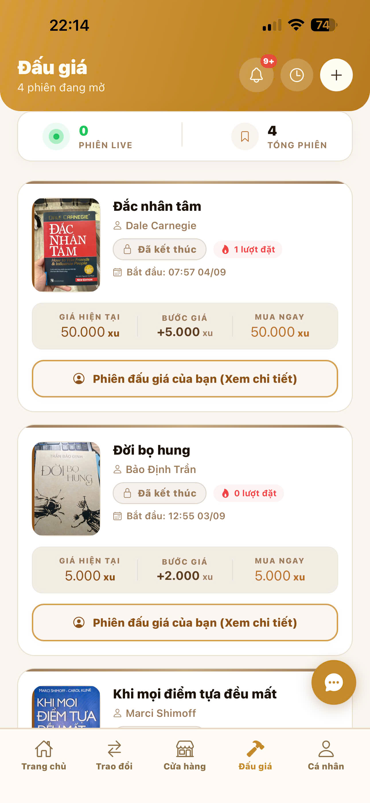

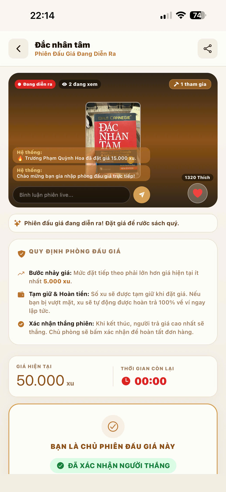

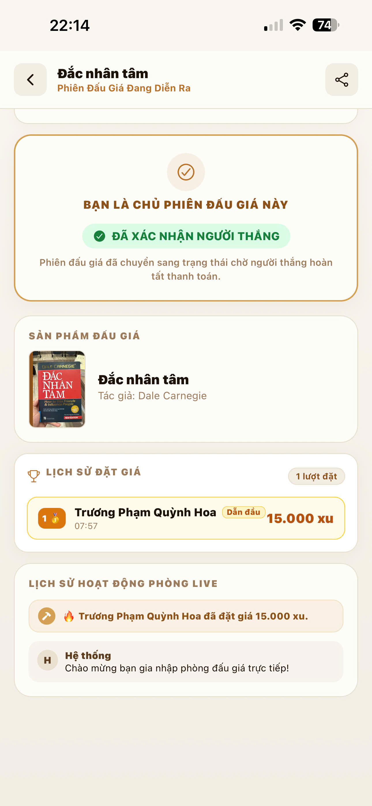

The auction functionality also supports real-time updates through Socket.IO.

---

## Book Exchange

Users can exchange books with other users through the exchange workflow.

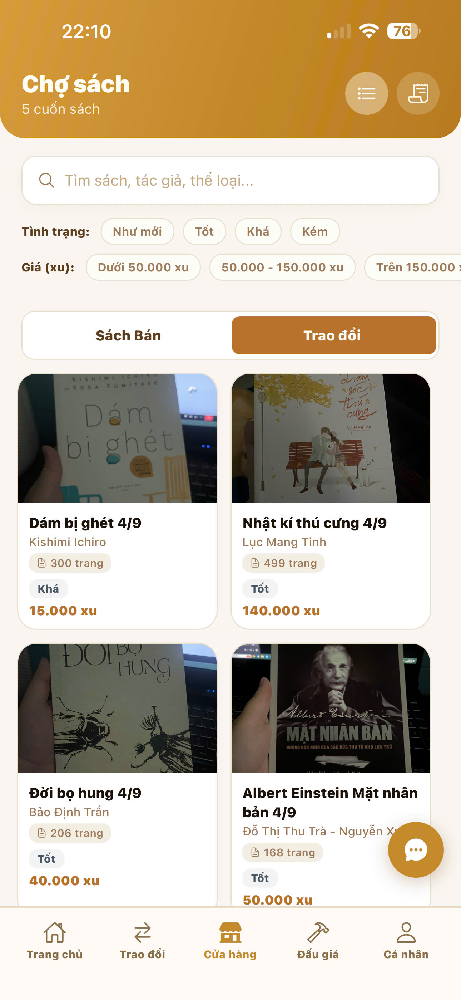

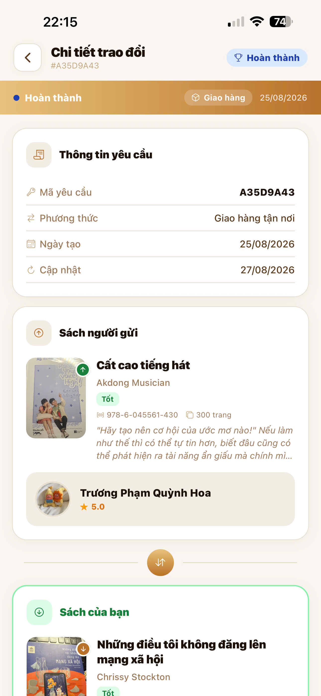

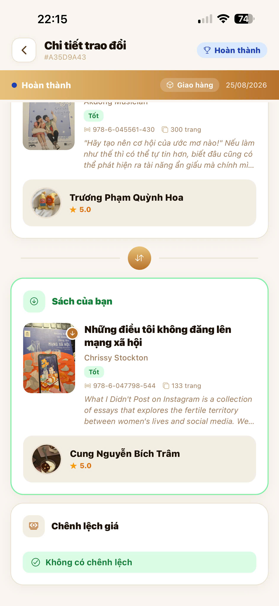

---

## Chat

The application provides a chat feature for communication between users.


Real-time communication is implemented using Socket.IO.

---

## Orders & Payment

Users can view and manage their orders and complete the payment process.

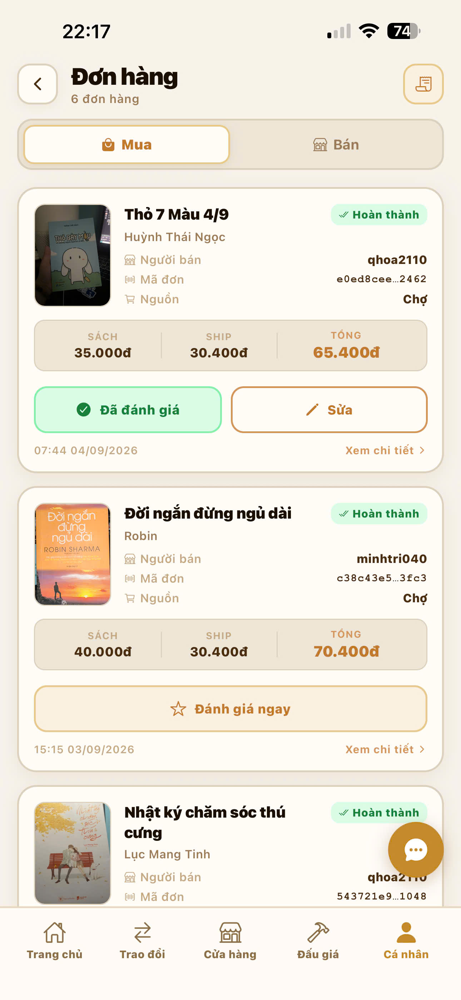

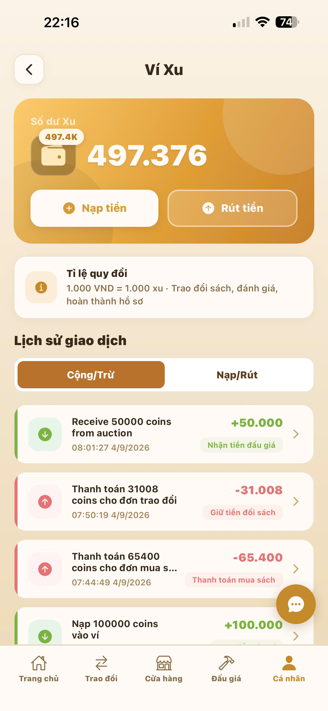

---

## Profile

Users can manage their profile and personal activities.

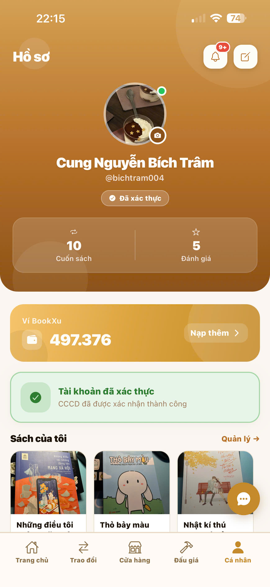

---

# 🖥️ Web Management Platform

The Web Application is primarily designed for **management and operational activities** rather than being the main platform for end users.

It provides interfaces for managing different parts of the BookSwap platform.

---

## Auction Management

Operational users can manage auction-related activities through the web platform.


---

## Order Management

The web platform provides interfaces for managing orders and viewing order-related information.


---

## Payment Management

Payment-related information can be reviewed and managed through the web platform.


---

## Report Management

The web platform also supports report management for operational and moderation purposes.


---

# System Architecture

BookSwap follows a multi-platform architecture consisting of a Mobile Application, Web Application, and Backend API.

```text
                         ┌──────────────────────┐
                         │       BookSwap       │
                         │       Platform       │
                         └──────────┬───────────┘
                                    │
                 ┌──────────────────┼──────────────────┐
                 │                  │                  │
                 ▼                  ▼                  ▼
        ┌────────────────┐  ┌────────────────┐  ┌────────────────┐
        │ Mobile App     │  │ Web App        │  │ Backend API    │
        │ React Native   │  │ Next.js        │  │ NestJS         │
        │ Expo           │  │ React          │  │ TypeScript     │
        └───────┬────────┘  └───────┬────────┘  └───────┬────────┘
                │                   │                   │
                │                   │                   │
                └──────── REST API / Socket.IO ─────────┘
                                    │
                         ┌──────────┴──────────┐
                         │                     │
                         ▼                     ▼
                  ┌──────────────┐      ┌──────────────┐
                  │ PostgreSQL   │      │ Redis        │
                  │ Database     │      │ Cache/Queue  │
                  └──────────────┘      └──────────────┘
```

### Application Flow

```text
End Users
    │
    ▼
Mobile Application
    │
    │ REST API / Socket.IO
    ▼
Backend API
    │
    ├── PostgreSQL
    │
    ├── Redis
    │
    └── Other Services
           │
           ▼
Management Users
           │
           ▼
     Web Application
```

---

# 🛠️ Tech Stack

## Mobile

* React Native
* Expo
* JavaScript
* React Navigation
* AsyncStorage
* Socket.IO Client
* Expo Camera
* Expo Image Picker
* Expo Document Picker
* React Native WebView

## Web

* Next.js
* React
* TypeScript
* Tailwind CSS
* Framer Motion
* Lucide React
* Recharts

## Backend

* NestJS
* TypeScript
* PostgreSQL
* TypeORM
* Redis
* Socket.IO
* JWT Authentication
* Passport
* BullMQ
* Cloudinary
* Swagger

---

# 💡 Technical Highlights

## Mobile-first User Experience

The Mobile Application is the main platform for end users and contains the majority of customer-facing features.

The application focuses on providing users with convenient access to marketplace, selling, auction, exchange, chat, order, and payment workflows.

## REST API Integration

Both the Mobile and Web applications communicate with the Backend API through RESTful APIs.

This allows the frontend applications to retrieve and update application data while keeping the frontend and backend responsibilities separated.

## Real-time Communication

Socket.IO is used to support real-time functionality.

It is particularly useful for features such as:

* Chat
* Auction bidding
* Real-time auction updates

## Role-based Management

The Web Application provides different management capabilities for operational roles.

This allows the system to separate end-user activities from management and moderation workflows.

## State and Navigation Management

The Mobile Application uses React Navigation and application-level state management to organize different user flows such as:

* Authentication
* Marketplace
* Auction
* Exchange
* Chat
* Orders
* Profile

---

# 👨‍💻 My Contribution

My main contribution to the BookSwap project focused on **Mobile Application development and Web Application development**.

## Mobile Application

* Developed user-facing interfaces using React Native and Expo
* Implemented mobile screens and user flows
* Integrated frontend features with Backend APIs
* Worked on marketplace-related interfaces
* Worked on book selling and book detail flows
* Worked on auction-related interfaces
* Worked on book exchange flows
* Worked on chat and communication interfaces
* Worked on order, payment, and profile interfaces

## Web Application

* Developed management interfaces using React and Next.js
* Implemented management screens and user flows
* Integrated Web interfaces with Backend APIs
* Worked on auction management
* Worked on order management
* Worked on payment management
* Worked on report management

My contribution primarily focused on the **frontend development of the Mobile and Web applications**, while the Backend was developed as part of the overall project architecture.

---

# 📚 Challenges & Learning

During the development of BookSwap, I gained practical experience working with a multi-platform application consisting of Mobile, Web, and Backend components.

Some of the main challenges and learning outcomes included:

### Working with Multiple Platforms

Developing both a Mobile Application and a Web Application required adapting UI and user flows to different platforms and use cases.

### API Integration

I gained experience integrating frontend applications with REST APIs and handling data loading, errors, authentication, and user interactions.

### Real-time Features

Working with Socket.IO helped me understand real-time communication and event-driven updates, especially for chat and auction functionality.

### Complex User Flows

Features such as auctions, exchanges, orders, and payments required multiple screens and states, which improved my understanding of designing and implementing complex frontend flows.

### Team Project Experience

As a graduation project, BookSwap also provided experience working within a team, coordinating different application components, and integrating frontend applications with backend services.

---

# 🔗 Project Repositories

The BookSwap project is divided into three repositories:

### 📱 Mobile Application

[BookSwap Mobile](https://github.com/mtri-coder/Mobilebookswap)

React Native + Expo mobile application for end users.

### 🖥️ Web Application

[BookSwap Web](https://github.com/mtri-coder/Webbookswap)

Next.js web application for management and operational activities.

### ⚙️ Backend API

[BookSwap Backend](https://github.com/mtri-coder/Bookswapbackend)

NestJS backend API providing business logic, database access, authentication, real-time services, and other backend functionality.

---

# 📊 Project Structure

```text
BookSwap
│
├── Mobile Application
│   ├── React Native
│   ├── Expo
│   └── Socket.IO Client
│
├── Web Application
│   ├── Next.js
│   ├── React
│   └── TypeScript
│
└── Backend API
    ├── NestJS
    ├── PostgreSQL
    ├── Redis
    └── Socket.IO
```

---

# 🚀 Project Status

BookSwap was developed as a **graduation project** and successfully completed as a multi-platform application.

The project demonstrates practical experience in:

* React Native
* React
* Next.js
* TypeScript
* JavaScript
* REST API integration
* Real-time communication
* Responsive UI development
* Mobile application development
* Web application development
* Git and GitHub
* Team-based software development

---

## 👋 About

BookSwap represents my experience building a real-world multi-platform application, with a primary focus on **Frontend development using React, Next.js, and React Native**.

The project allowed me to work across both user-facing mobile experiences and web-based management systems while integrating them with a shared backend architecture.
